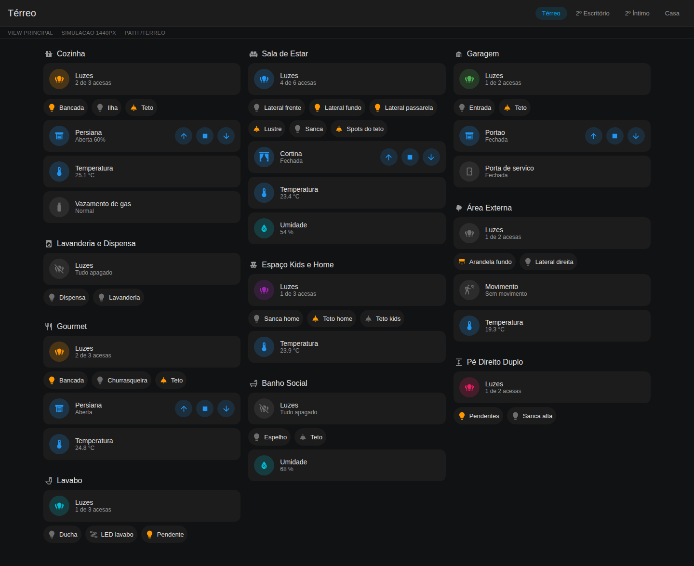
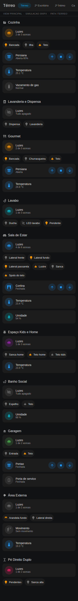
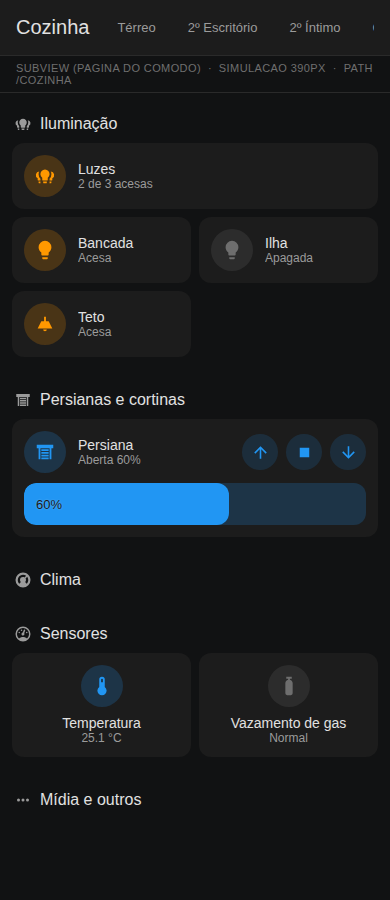

# Painel Novo — dashboard responsivo por cômodo (Home Assistant)

Um painel **novo e independente**, criado do zero ao lado do painel existente.
Ele não toca em nada do que você já tem: é adicionado como uma URL separada, você
usa os dois em paralelo e apaga o antigo quando quiser.



## O problema que ele resolve

Cada cômodo tem uma quantidade diferente de luminárias, e listar lâmpada por
lâmpada no YAML significa reeditar o painel toda vez que uma muda de lugar.

Aqui **nenhuma luminária é listada**. Cada cômodo aponta para uma **área** do
Home Assistant e o painel descobre em tempo real todas as luzes daquela área.
Trocou uma lâmpada, adicionou uma arandela, moveu um abajur de cômodo? O painel
já mostra certo no próximo carregamento, sem editar YAML.

## As telas

As abas são os **pavimentos** — é onde o dia a dia acontece. O painel geral
fica por último, porque quase nunca se usa.

| Aba | O que tem nela |
|---|---|
| **Térreo**, **1º Pav**, **2º Pav · …** | Um bloco por cômodo: mestre de luz, um botão por luminária, persianas e sensores |
| **Casa** (última) | Painel geral: estado da casa e um atalho por pavimento |
| **&lt;Cômodo&gt;** (sem aba) | Ambiente completo: iluminação, persianas, clima, sensores e mídia |

Toque no card mestre alterna o bloco inteiro. Toque no título do cômodo (ou
segure o mestre) abre a página do ambiente.

Cada pavimento é um item de `pavimentos:` no config, e a ordem dos blocos na
tela é a ordem em que você os escreve. Um pavimento sem blocos não vira aba.

## Partir um cômodo em dois blocos

Às vezes um cômodo do Home Assistant é uma coisa só, mas no uso são duas: a
cozinha e a lavanderia se acendem juntas às vezes e separadas outras. Um bloco
**não precisa ser uma área** — pode ser um recorte dela:

```yaml
- nome: Cozinha
  area: Cozinha
  excluir: [light.*lavanderia*, light.*dispensa*]   # o que saiu daqui

- nome: Lavanderia e Dispensa
  area: Cozinha
  luzes: [light.*lavanderia*, light.*dispensa*]     # o que veio para cá
  persianas: false        # não repetir as da Cozinha
  sensores: false
```

E o contrário também: `luzes_de_fora:` traz para o bloco luminárias que estão
em **outra** área — as laterais que pertencem à Área Externa mas fazem parte da
Sala de Estar.

| Campo | Para quê |
|---|---|
| `luzes` | Só as luzes da área que casam com estes padrões |
| `excluir` | Padrões que este bloco ignora |
| `luzes_de_fora` | Luzes de outra área que aparecem aqui |
| `persianas` / `sensores` | `false` no bloco separado, para não duplicar |

O toque no mestre respeita esses filtros: apagar a "Lavanderia e Dispensa" não
apaga a cozinha. É o `script.alternar_luzes_do_bloco` do package que garante
isso — por isso ele é **obrigatório** quando você usa esses campos.

### Conferir se a separação funcionou

```bash
python3 tools/conferir_blocos.py
```

Lista, bloco por bloco, as luminárias que caíram nele. Avisa quando um bloco
ficou vazio, quando uma luz aparece em dois blocos, ou quando uma luz da casa
não aparece em nenhum.

E faz a conferência que mais importa: pega os templates Jinja direto de
`packages/painel_novo.yaml`, calcula em quais luzes o toque no mestre agiria, e
compara com as que o bloco mostra. Se o script e o painel saírem de sincronia,
ele acusa antes de você descobrir apagando a cozinha inteira:

```
Lavanderia e Dispensa  2x  Dispensa, Lavanderia   <-- MESTRE DIVERGE
ERRO: Lavanderia e Dispensa: o mestre pegaria a mais
      [light.cozinha_bancada, light.cozinha_ilha, light.cozinha_teto]
```

```
=== Térreo ===
  Cozinha                    3x  Bancada, Ilha, Teto
  Lavanderia e Dispensa      2x  Dispensa, Lavanderia
  Gourmet                    3x  Bancada, Churrasqueira, Teto
  Lavabo                     3x  Ducha, LED lavabo, Pendente
```

## Descobrir os seus entity_id

Os padrões de `luzes:` são inúteis se você não souber como as suas luzes se
chamam. Para levantar isso:

```bash
python3 tools/descobrir.py
```

Ele imprime um template Jinja. Cole em **Ferramentas de Desenvolvedor →
Modelo** no Home Assistant, e o resultado já sai no formato de
`config/casa_exemplo.yaml` — salve por cima do arquivo e a pré-visualização
passa a ser a sua casa de verdade, com os seus nomes e os seus relés.

Feito isso, `tools/conferir_blocos.py` passa a sugerir os `temperatura:` e
`umidade:` que faltam em cada bloco. Vale seguir a sugestão: declarado, o sensor
vira etiqueta no título em vez de card de largura inteira. Medido na casa de
exemplo, declarar todos encurtou a aba Térreo de **1175 px para 929 px** no
desktop e de 2989 px para 2483 px no celular.

## A gramática visual

O painel usa **três formas diferentes** para três significados diferentes, para
você saber o que é o quê sem ler:

| Forma | Significa | Exemplo |
|---|---|---|
| **Pílula** com nome | Luminária. Aperto para acender/apagar | `( 💡 Abajur )` |
| **Card com ↑ ■ ↓** | Persiana ou cortina. Controlo com os botões | `[ 🪟 Persiana  ↑ ■ ↓ ]` |
| **Card sem botão** | Sensor. Só leio | `[ 🚶 Movimento — Detectado ]` |
| **Etiqueta no título** | Clima do ambiente | `23.4 °C   54 %` |

Cada cômodo tem uma **cor de destaque** própria (`cor:` no config, ou distribuída
automaticamente), usada no mestre e nos ícones ativos.

## Lâmpadas comuns de liga/desliga

Se as suas lâmpadas **não são dimerizáveis**, ponha `brilho: nunca` em
`config/comodos.yaml`. É o padrão deste repositório.

Não é só cosmético. Slider e porcentagem somem, e aí **todo card de luz passa a
ter a altura de uma linha** — o que deixa duas colunas encaixarem sem sobra:

| `brilho` | `colunas_luzes` | Aba Luzes no desktop |
|---|---|---|
| `nunca` | 2 | **945 px** |
| `auto` | 1 | 1371 px |
| `auto` | 2 | 1377 px, com caixas vazias |

A última linha é a armadilha: misturar cards com e sem slider na mesma linha faz
a grade igualar as alturas, e a luz **sem** slider vira uma caixa grande e vazia
ao lado da que tem. Se você usa `brilho: auto`, use `colunas_luzes: 1`.

> Com `brilho: nunca`, **não vale a pena criar os grupos de luz** (passo 4 da
> instalação): o mestre já acende e apaga o cômodo inteiro sozinho, e o grupo só
> acrescentaria um slider que as suas lâmpadas não usam.

## Por que a tela principal não mostra um card por luminária

Foi a primeira versão, e ela media 1900 px de altura no desktop — o Escritório
sozinho ocupava 800 px. A tela principal virou um **resumo**: mestre do cômodo
mais um botão por luminária, o que cabe a casa inteira em cerca de 1100 px. O
detalhe fica a um toque de distância, na página do cômodo.

Se você preferir cards em vez de botões na tela principal, é uma linha:
`estilo_luzes: cards` em `config/comodos.yaml`.

## Quantas colunas usar

Blocos de cômodo **não se dividem** entre colunas. Com cômodos de tamanhos bem
diferentes, mais colunas costuma deixar *mais* sobra no pé das mais curtas, não
menos. Medido nesta casa de exemplo, a 1440 px:

| `colunas_max` | Altura da página | Espaço vazio |
|---|---|---|
| 2 | 1671 px | 17 % |
| **3** | **1113 px** | **9 %** |
| 4 | 1071 px | 24 % |

Por isso o padrão é 3. O número certo depende dos **seus** cômodos — meça com
`python3 tools/preview.py --metricas`.

## No celular

 

*Aba Térreo e página de um cômodo, ambas em 390 px.*

O layout usa a view `sections` nativa do Home Assistant: as colunas se
reorganizam sozinhas conforme a largura — 4 no desktop, 1 no celular, sem media
query. Cômodo com 1 luminária ocupa um bloco pequeno, cômodo com 10 cresce
verticalmente, e o `dense_section_placement` encaixa os blocos curtos nos
buracos em vez de deixar espaço morto.

> O empacotamento denso **reordena** os blocos no desktop para preencher os
> vãos. Se você quer os cômodos exatamente na ordem do config, use
> `densidade: false`.

## Estrutura do repositório

```
config/comodos.yaml         <- o ÚNICO arquivo que você edita
config/casa_exemplo.yaml    <- sua casa, para a pré-visualização (tools/descobrir.py)
tools/gerar_painel.py       <- gera o dashboard a partir do config
tools/validar.py            <- confere o YAML gerado antes de colar no HA
tools/testar.py             <- roda todas as conferências de uma vez
tools/conferir_blocos.py    <- mostra que luminárias caíram em cada bloco
tools/descobrir.py          <- levanta os entity_id reais da sua casa
tools/preview.py            <- desenha o painel e tira fotos dele
tools/ha_mock.py            <- simulação do HA usada pelas ferramentas acima
tools/extrair_icones.py     <- vendora os ícones MDI usados (offline)
dashboards/painel-novo.yaml <- GERADO. não edite à mão
packages/painel_novo.yaml   <- script de apoio (OBRIGATÓRIO com blocos partidos)
docs/INSTALACAO.md          <- passo a passo de instalação
```

## Uso

```bash
python3 tools/descobrir.py                # 0. levante seus entity_id (uma vez)
$EDITOR config/comodos.yaml               # 1. edite pavimentos e blocos
python3 tools/testar.py                   # 2. gera e roda todas as conferências
python3 tools/preview.py --metricas       # 3. veja e meça, sem instalar nada
```

`tools/testar.py` é o comando do dia a dia: gera o painel, confere se ele está
em dia com o config, valida o YAML, confere as separações de luz, testa o
template de descoberta e o package. Sai com código 1 se algo falhar, então
serve em gancho de commit.

`config/comodos.yaml` pede, por bloco, um **nome** e a **área** do Home
Assistant. Cor, ícone, temperatura, umidade, filtros de luz e entidades extras
são opcionais.

### Ver antes de instalar

`tools/preview.py` desenha o painel numa página HTML com o tema escuro do Home
Assistant e tira screenshots em 1440, 820 e 390 px, usando a casa fictícia de
`config/casa_exemplo.yaml` — que tem de propósito cômodos de 1 a 6 luminárias,
para você ver se o layout aguenta os seus extremos. Edite esse arquivo para
descrever a sua casa e a pré-visualização passa a ser a sua.

`--metricas` mede quanto de cada coluna fica vazio, para você comparar
configurações em vez de chutar.

A casa de exemplo tem de propósito só 4 lâmpadas dimerizáveis em 24 — se as suas
forem todas dimerizáveis, marque `dimeriza: true` nelas e a pré-visualização
passa a mostrar os sliders.

Não é o Home Assistant: fontes e espaçamentos são próximos, não idênticos.

### Conferências automáticas

- `tools/gerar_painel.py` recusa config quebrada: área faltando, dois cômodos
  que gerariam a mesma URL, nome reservado (`Casa`, `Luzes`), cor inexistente,
  `grupo` que não é uma entidade `light.*`.
- `tools/gerar_painel.py --check` não escreve nada e falha se o YAML gerado
  estiver desatualizado em relação ao config.
- `tools/validar.py` confere o YAML gerado: paths únicos, todo
  `navigation_path` apontando para uma view que existe, todos os templates
  Jinja compilando e nenhum custom card fora da lista conhecida.

## Pré-requisitos (HACS)

| Card | Repositório |
|---|---|
| `auto-entities` | thomasloven/lovelace-auto-entities |
| `Mushroom` | piitaya/lovelace-mushroom |
| `card-mod` | thomasloven/lovelace-card-mod |

Requer Home Assistant **2024.11 ou mais novo** (views `sections`, card `heading`
com badges, `grid_options`, sintaxe `perform-action`).

Passo a passo completo em [docs/INSTALACAO.md](docs/INSTALACAO.md).
