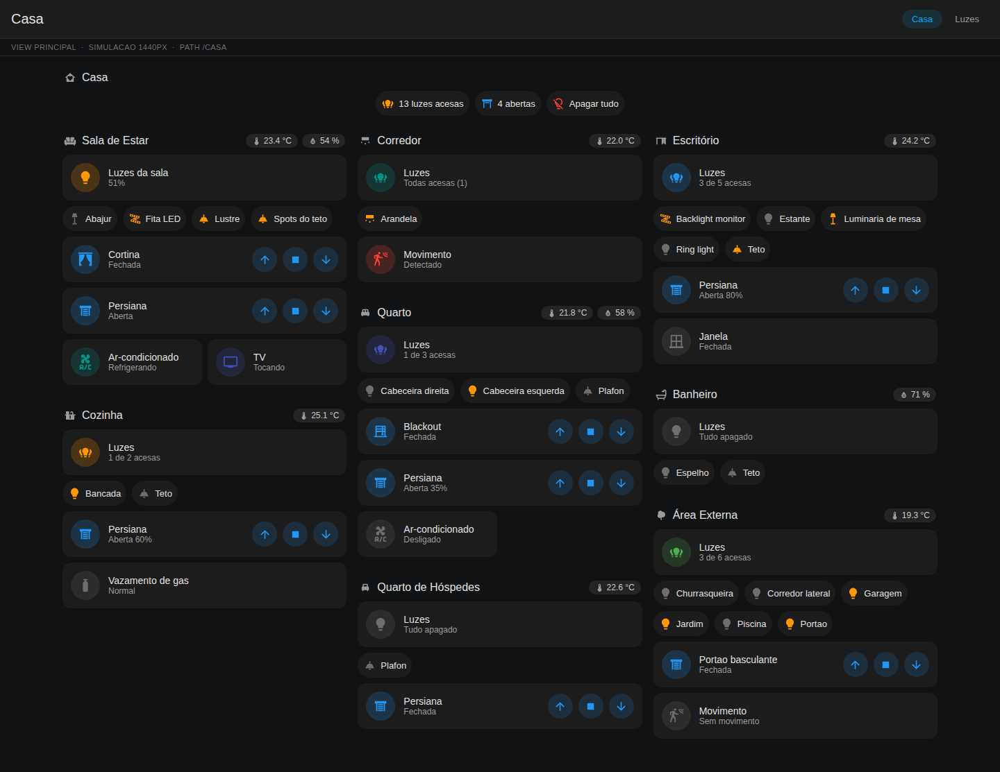
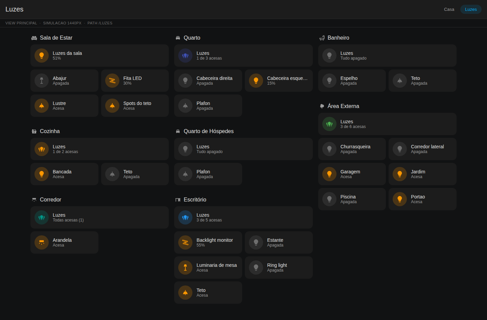
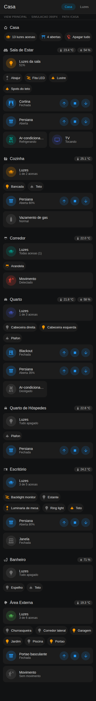

# Painel Novo — dashboard responsivo por cômodo (Home Assistant)

Um painel **novo e independente**, criado do zero ao lado do painel existente.
Ele não toca em nada do que você já tem: é adicionado como uma URL separada, você
usa os dois em paralelo e apaga o antigo quando quiser.



## O problema que ele resolve

Cada cômodo tem uma quantidade diferente de luminárias, e listar lâmpada por
lâmpada no YAML significa reeditar o painel toda vez que uma muda de lugar.

Aqui **nenhuma luminária é listada**. Cada cômodo aponta para uma **área** do
Home Assistant e o painel descobre em tempo real todas as luzes daquela área.
Trocou uma lâmpada, adicionou uma arandela, moveu um abajur de cômodo? O painel
já mostra certo no próximo carregamento, sem editar YAML.

## As três telas

| Tela | Função | O que tem nela |
|---|---|---|
| **Casa** | Resumo | Um bloco por cômodo: mestre de luz, um botão por luminária, persianas e sensores |
| **Luzes** | Controle fino | Brilho, temperatura e cor de **todas** as luminárias, agrupadas por cômodo |
| **&lt;Cômodo&gt;** | Ambiente completo | Iluminação, persianas, clima, sensores e mídia daquele cômodo, em seções separadas |

Toque no card mestre alterna o cômodo inteiro. Toque no título do cômodo (ou
segure o mestre) abre a página do ambiente.

## A gramática visual

O painel usa **três formas diferentes** para três significados diferentes, para
você saber o que é o quê sem ler:

| Forma | Significa | Exemplo |
|---|---|---|
| **Pílula** com nome | Luminária. Aperto para acender/apagar | `( 💡 Abajur )` |
| **Card com ↑ ■ ↓** | Persiana ou cortina. Controlo com os botões | `[ 🪟 Persiana  ↑ ■ ↓ ]` |
| **Card sem botão** | Sensor. Só leio | `[ 🚶 Movimento — Detectado ]` |
| **Etiqueta no título** | Clima do ambiente | `23.4 °C   54 %` |

Cada cômodo tem uma **cor de destaque** própria (`cor:` no config, ou distribuída
automaticamente), usada no mestre e nos ícones ativos.

## Lâmpadas comuns de liga/desliga

Se as suas lâmpadas **não são dimerizáveis**, ponha `brilho: nunca` em
`config/comodos.yaml`. É o padrão deste repositório.

Não é só cosmético. Slider e porcentagem somem, e aí **todo card de luz passa a
ter a altura de uma linha** — o que deixa duas colunas encaixarem sem sobra:

| `brilho` | `colunas_luzes` | Aba Luzes no desktop |
|---|---|---|
| `nunca` | 2 | **945 px** |
| `auto` | 1 | 1371 px |
| `auto` | 2 | 1377 px, com caixas vazias |



*Aba Luzes com `brilho: nunca` e `colunas_luzes: 2`: 24 luminárias e 8 mestres
em 945 px, todos os cards com a mesma altura.*

A última linha é a armadilha: misturar cards com e sem slider na mesma linha faz
a grade igualar as alturas, e a luz **sem** slider vira uma caixa grande e vazia
ao lado da que tem. Se você usa `brilho: auto`, use `colunas_luzes: 1`.

> Com `brilho: nunca`, **não vale a pena criar os grupos de luz** (passo 4 da
> instalação): o mestre já acende e apaga o cômodo inteiro sozinho, e o grupo só
> acrescentaria um slider que as suas lâmpadas não usam.

## Por que a tela principal não mostra um card por luminária

Foi a primeira versão, e ela media 1900 px de altura no desktop — o Escritório
sozinho ocupava 800 px. A tela principal virou um **resumo**: mestre do cômodo
mais um botão por luminária, o que cabe a casa inteira em cerca de 1100 px. O
detalhe fica a um toque de distância, na página do cômodo.

Se você preferir cards em vez de botões na tela principal, é uma linha:
`estilo_luzes: cards` em `config/comodos.yaml`.

## Quantas colunas usar

Blocos de cômodo **não se dividem** entre colunas. Com cômodos de tamanhos bem
diferentes, mais colunas costuma deixar *mais* sobra no pé das mais curtas, não
menos. Medido nesta casa de exemplo, a 1440 px:

| `colunas_max` | Altura da página | Espaço vazio |
|---|---|---|
| 2 | 1671 px | 17 % |
| **3** | **1113 px** | **9 %** |
| 4 | 1071 px | 24 % |

Por isso o padrão é 3. O número certo depende dos **seus** cômodos — meça com
`python3 tools/preview.py --metricas`.

## No celular

 

*Tela principal e página de um cômodo, ambas em 390 px.*

O layout usa a view `sections` nativa do Home Assistant: as colunas se
reorganizam sozinhas conforme a largura — 4 no desktop, 1 no celular, sem media
query. Cômodo com 1 luminária ocupa um bloco pequeno, cômodo com 10 cresce
verticalmente, e o `dense_section_placement` encaixa os blocos curtos nos
buracos em vez de deixar espaço morto.

> O empacotamento denso **reordena** os blocos no desktop para preencher os
> vãos. Se você quer os cômodos exatamente na ordem do config, use
> `densidade: false`.

## Estrutura do repositório

```
config/comodos.yaml         <- o ÚNICO arquivo que você edita
config/casa_exemplo.yaml    <- casa fictícia usada só pela pré-visualização
tools/gerar_painel.py       <- gera o dashboard a partir do config
tools/validar.py            <- confere o YAML gerado antes de colar no HA
tools/preview.py            <- desenha o painel e tira fotos dele
tools/ha_mock.py            <- simulação do HA usada pela pré-visualização
tools/extrair_icones.py     <- vendora os ícones MDI usados (offline)
dashboards/painel-novo.yaml <- GERADO. não edite à mão
packages/painel_novo.yaml   <- script de apoio (alternância inteligente)
docs/INSTALACAO.md          <- passo a passo de instalação
```

## Uso

```bash
$EDITOR config/comodos.yaml               # 1. edite os cômodos
python3 tools/gerar_painel.py             # 2. gere o painel
python3 tools/validar.py                  # 3. confira o YAML
python3 tools/preview.py --metricas       # 4. veja e meça, sem instalar nada
```

`config/comodos.yaml` só pede, por cômodo, o **nome exato da área** e um ícone.
Cor, temperatura, umidade, grupo de luz e entidades extras são opcionais.

### Ver antes de instalar

`tools/preview.py` desenha o painel numa página HTML com o tema escuro do Home
Assistant e tira screenshots em 1440, 820 e 390 px, usando a casa fictícia de
`config/casa_exemplo.yaml` — que tem de propósito cômodos de 1 a 6 luminárias,
para você ver se o layout aguenta os seus extremos. Edite esse arquivo para
descrever a sua casa e a pré-visualização passa a ser a sua.

`--metricas` mede quanto de cada coluna fica vazio, para você comparar
configurações em vez de chutar.

A casa de exemplo tem de propósito só 4 lâmpadas dimerizáveis em 24 — se as suas
forem todas dimerizáveis, marque `dimeriza: true` nelas e a pré-visualização
passa a mostrar os sliders.

Não é o Home Assistant: fontes e espaçamentos são próximos, não idênticos.

### Conferências automáticas

- `tools/gerar_painel.py` recusa config quebrada: área faltando, dois cômodos
  que gerariam a mesma URL, nome reservado (`Casa`, `Luzes`), cor inexistente,
  `grupo` que não é uma entidade `light.*`.
- `tools/gerar_painel.py --check` não escreve nada e falha se o YAML gerado
  estiver desatualizado em relação ao config.
- `tools/validar.py` confere o YAML gerado: paths únicos, todo
  `navigation_path` apontando para uma view que existe, todos os templates
  Jinja compilando e nenhum custom card fora da lista conhecida.

## Pré-requisitos (HACS)

| Card | Repositório |
|---|---|
| `auto-entities` | thomasloven/lovelace-auto-entities |
| `Mushroom` | piitaya/lovelace-mushroom |
| `card-mod` | thomasloven/lovelace-card-mod |

Requer Home Assistant **2024.11 ou mais novo** (views `sections`, card `heading`
com badges, `grid_options`, sintaxe `perform-action`).

Passo a passo completo em [docs/INSTALACAO.md](docs/INSTALACAO.md).
